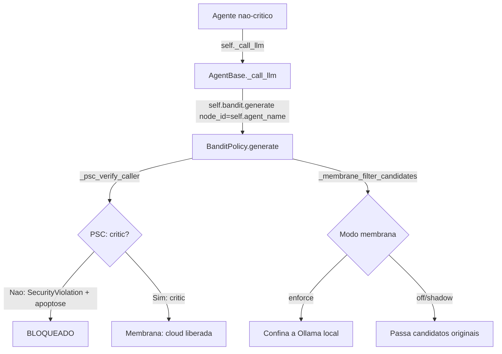

# iaglobal — Agent Instructions

## Setup

```bash
source venv/bin/activate
pip install -e .
# .env already has defaults; edit to set API keys, OLLAMA_MODEL, etc.

# Optional: set SEARXNG_URL in .env (default: http://localhost:8005)
```

Run tests: `python -m pytest iaglobal/tests/ -q`

## Non-Negotiable Conventions

- **Async-only.** Every I/O operation must be async or wrapped in `asyncio.to_thread()`. Never introduce blocking calls in the main event loop.
- **No `print()`.** Use `logging` only. Import with `from iaglobal.utils.logger import get_logger` and call `get_logger("iaglobal")`.
- **AST parsing.** Never call `ast.parse()` directly. Always use `ASTGateway` from `iaglobal.security.ast_gateway` (exception: that file itself).
- **LLM access.** Only the `critic` node may call `BanditPolicy.generate()` for model access. All other agents must route through `_get_critic().arbitrar_geracao(node_id=..., prompt=...)`. Violations trigger apoptosis.
- **Provider authority.** `iaglobal/providers/provider_router.py` is the sole importer of external providers. No other module may import from `iaglobal.providers` for generation.
- **Node structure.** Each pipeline node lives in its own file `iaglobal/graphs/nodes/no_<name>.py` and exports `async def run_<name>(...)`. `nodes.py` is a dynamic proxy — keep it lightweight.
- **Telemetry contract.** Every node result that performs heavy work must include the key `"execution_metrics"` (not `__execution_metrics__`). Shape: `{"success": bool, "latency": float, "cost": float, "model": str}`.
- **Lineage marker.** Every `.py` file must start with `# 🧬 LINEAGE_MARKER: cc7017b56557586095e8dc6dae27b3e61feac8ab7bb9c2ca229a3723bc250524f3b65d01c3a7d148ba2f0282e63484bfb884f6425a36aba3cee3edd37b01e136`.
- **Test artifacts.** All test-generated files go to `iaglobal/tests/temp/`. Use the `tests_temp_dir` fixture. Do not write to project root.

## Architecture Boundaries

| Subsystem | Owns | Must not touch |
|-----------|------|----------------|
| `evolution/` | evolution, metacognition, learning, adaptation | memory persistence |
| `memory/` | retrieval, storage, snapshots, cognitive context | agent orchestration |
| `immunity/` | defense, apoptosis, vaccines, pruning | LLM generation |
| `providers/` | external model transport | business logic |
| `graphs/` | DAG, topology, nodes, execution | direct OS calls |

## Commands

| Purpose | Command |
|---------|---------|
| Run all tests | `python -m pytest iaglobal/tests/ -q` |
| Run single test file | `pytest iaglobal/tests/test_*.py -v` |
| Architectural audit | `python -m iaglobal.auditoria_arquitetural` |
| Topology contract check | `python -m pytest iaglobal/tests/test_topology_contract.py -v` |
| PSC sovereignty tests | `python -m pytest iaglobal/tests/test_psc_hierarchy.py -v` |
| Mitochondrial probe tests | `python -m pytest iaglobal/tests/test_mitochondrial_probe.py -v` |
| Instrument decorator tests | `python -m pytest iaglobal/tests/test_instrument_decorator.py -v` |
| CLI task execution | `iaglobal run "task description"` |
| CLI system dashboard | `iaglobal status` |
| CLI history | `iaglobal history --list` / `iaglobal history <id> --explain` |
| Run evolution lab | `OLLAMA_BASE_URL=http://localhost:11434 evolution-lab` |
| Set SEARXNG_URL | `export SEARXNG_URL=http://localhost:8005` (default) |

## Before You Commit

1. Run `python -m pytest iaglobal/tests/ -q` and confirm zero regressions.
2. Run `python -m iaglobal.auditoria_arquitetural` to detect orphaned functions or naming collisions.
3. Verify no file lost the lineage marker header.
4. If you touched pipeline nodes, run `python -m pytest iaglobal/tests/test_topology_contract.py -v`.

## 🧬 Testing Standards

### 📁 Output Directory

**EVERY** file generated during test execution (logs, databases, reports, temporary artifacts) must be written to `tests/temp/`.

```python
from pathlib import Path

def test_exemplo(tests_temp_dir: Path):
    db_path = tests_temp_dir / "meu_teste.db"
```

The `conftest.py` file provides the `tests_temp_dir` fixture, which points to `tests/temp/`. The fixture automatically cleans up files between runs (except for `__pycache__`).

### ❌ Prohibited

- Writing files to the project root directory (`./`)
- Using `tempfile.mkdtemp()` — prefer `tests_temp_dir`
- Hardcoding absolute paths (`/home/...`)
- Using `Path(__file__).parent.parent / "file"` for writing (read-only)

### ✅ Allowed

- pytest's native `tmp_path` for ephemeral data (provided it doesn't clutter the project)
- `tests_temp_dir` for artifacts that need to be inspected after the test
- `Path(__file__).parent.parent / "iaglobal"` for **reading** source code

### 🧹 Cleanup

The `_clean_tests_temp` fixture automatically removes files from `tests/temp/` at the end of each test session. To persist an artifact, manually move it out of `tests/temp/`.

### ⚙️ Configuration

`pyproject.toml` already excludes `temp` from test discovery:

```toml
[tool.pytest.ini_options]
norecursedirs = "scripts venv .git .pytest_cache temp"
```

## Environment Variables

| Variable | Default | Where consumed |
|----------|---------|----------------|
| `OLLAMA_MODEL` | `qwen2.5:0.5b` | providers, agent_base |
| `PROVIDER_FALLBACK_CHAIN` | `BANDIT_POLICY` (delega ao BanditPolicy) | .env.example (não lido por código Python — fallback real via `OLLAMA_ONLY` + BanditPolicy) |
| `BANDIT_POLICY` | `epsilon_greedy` | graphs/bandit.py |
| `MEMORY_STORAGE_TYPE` | `sqlite` | storage backends |
| `METABOLIC_STORAGE_TYPE` | `auto` | metabolic_adapter |
| `PIPELINE_MAX_WORKERS` | `8` | pipeline engine |
| `PROVIDER_TIMEOUT` | `30` | provider_router |
| `SEARXNG_URL` | `http://localhost:8005` | _search_sources.py |

```bash
# Storage type (consumido pelo MetabolicDataAdapter e MemoryFirstRouter)
METABOLIC_STORAGE_TYPE=auto        # auto | cbor2 | json | sqlite
MEMORY_STORAGE_TYPE=sqlite         # sqlite | json | cbor2

# Bandit policy
BANDIT_POLICY=epsilon_greedy
epsilon=0.2

# Provider timeout (seconds)
PROVIDER_TIMEOUT=30
```

## 🛡️ Immune System: 12-Layer Defense

| Layer | Module | Function | Tests |
|-------|--------|----------|-------|
| **Genesis** | `genesis/verifygenesis.py` | SHA3-512 DNA tribunal (immutable) | ✅ Verified |
| **Identity** | `genesis/identity.py` | Sovereign ephemeral IDs | ✅ Functional |
| **Sentinel** | `security/entropy_sentinel.py` | Anti-manipulation sweep | 6/6 ✅ |
| **MHC** | `immunity/mhc_detector.py` | Fingerprints + anomaly scoring | 9/9 ✅ |
| **Pathogen** | `immunity/pathogen_analyzer.py` | Code injection detection | 7/7 ✅ |
| **Cost** | `evolution/metabolism/opportunity_cost_detector.py` | Agent cost-benefit analysis | 8/8 ✅ |
| **Masking** | `immunity/epigenetic_masking.py` | Critical memory barrier | 7/7 ✅ |
| **Apoptosis** | `immunity/apoptosis_engine.py` | Clean node elimination | 7/7 ✅ |
| **Orchestrator** | `immunity/immune_orchestrator.py` | 5-layer integration | 9/9 ✅ |
| **Adaptive** | `immunity/adaptive_threat_detector.py` | Continuous threat learning | 7/7 ✅ |
| **Exchange** | `immunity/immune_memory_exchange.py` | Vaccine sharing between nodes | 9/9 ✅ |
| **Prune** | `immunity/metabolic_pruner.py` | TTL pruning + de-duplication | 11/11 ✅ |

### Verified Genesis Hash

```
GENESIS_HASH_OFFICIAL = "cc7017b56557586095e8dc6dae27b3e61feac8ab7bb9c2ca229a3723bc250524f3b65d01c3a7d148ba2f0282e63484bfb884f6425a36aba3cee3edd37b01e136"
```

### ⚡ IVM Formula (Índice de Viabilidade Metabólica)

Fonte canônica: `iaglobal/chappie/ivm_axiom.py:19` (ÚNICA fonte — `cpu_affinity.py` espelha; `adaptive_router.py` tem fórmula de 4 termos desatualizada).

```
IVM = (P × 0.4) + (E × 0.4) + (C × 0.2)

P = Task completion rate (Productivity)
E = Composta: 0.7 × E_latência(Chappie) + 0.3 × E_cpu(CpuAffinityManager)
    E_latência = 1 / latência normalizada
    E_cpu = 1 − (uso_cpu / budget_25%) × 0.5
C = Cooperação: média(skills_exchanged/10, mhc_validation_score)
```

**Ajuste epigenético por agente**: Pesos base (P=0.4, E=0.4, C=0.2) são ajustados por `_ajustar_pesos_epigeneticos()` conforme métricas de runtime. Exemplo: se latency_ratio > 2x, E → min(0.2) e P → max(0.6). Critic tipicamente roda com P≈0.50, E≈0.30 por sua latência cloud.

## 🧬 Biological Architecture Reference

**Paradigma**: Auto-Evolutionary Biological Computing

**Ciclos Implementados**: Metilação · Glutationa · Autofagia · Mitose · Apoptose · Epigenética · Sinalização Celular

### 8 Axiomas Biológicos

| # | Axioma | Core Concept |
|---|--------|--------------|
| 1 | Lei da Homeostase Arquitetural | Sistema tamponado: circuit breaker, rate limiter, backpressure |
| 2 | Ciclo da Metilação | Pipeline como Metionina→SAMe→Homocisteína→reciclagem |
| 3 | Ciclo da Glutationa | Defesa antioxidante: GSH captura ROS, GSSG reciclado por NADPH |
| 4 | Autofagia | Limpeza evolutiva: degradar + reciclar componentes danificados |
| 5 | Mitose e Diferenciação | Escalar com diversidade, não clones homogêneos |
| 6 | Apoptose | Morte celular programada = graceful shutdown com transferência de estado |
| 7 | Epigenética | Config dinâmica sem alterar código (feature flags, pesos runtime) |
| 8 | Sinalização Celular | Event-driven: ligantes → receptores → cascata intracelular |

### 8 Princípios Imutáveis

1. A célula sente seu próprio estado (observabilidade endógena)
2. Energia é conservada, não criada (otimizar cadeia de transporte)
3. A membrana é inteligente, não passiva (API Gateway seletivo)
4. Mutação sem seleção é ruído (todo variação precisa de seletor de fitness)
5. Organismos cooperam para sobreviver (simbiose, não competição)
6. A morte programada é saúde, não falha (apoptose ≠ necrose)
7. Memória imunológica é o ativo mais valioso (anticorpos arquiteturais)
8. Evolução não tem destino — projete para adaptabilidade máxima

### Ciclo Operacional Metabólico

1. **Percepção Sensorial** — natureza do sinal, ciclo comprometido, estresse oxidativo
2. **Síntese de Contexto (SAMe Activation)** — enriquecer input, mapear pressões seletivas
3. **Análise Sistêmica** — visões genômica, mitocondrial, imunológica, evolutiva
4. **Síntese de Solução (Ribossomo)** — observabilidade, feedback, auto-reparo, autofagia, apoptose, epigenética
5. **Expressão do Resultado** — diagnóstico, mapa de ciclos, síntese, perfil antioxidante, auto-regeneração, plano de diferenciação, evolução epigenética, vetor evolutivo

## Storage Type Config

| Variável | Valores | Default | Efeito |
|----------|---------|---------|--------|
| `METABOLIC_STORAGE_TYPE` | auto, cbor2, json, sqlite | auto | Filtra fontes do MetabolicDataAdapter |
| `MEMORY_STORAGE_TYPE` | sqlite, json, cbor2 | sqlite | Backend de persistência STM/LTM |

## Dependency Resolution

- `DependencyAgent.resolve_dependencies()` filtra seções do `requirements.txt` baseado no contexto de arquitetura (framework, tech_stack)
- `verify_dependencies()` checa imports do código vs pacotes instalados
- Ambos integrados no nó `no_dependency.py`

## Key Entry Points

- `iaglobal/cli/main.py` — CLI entry point
- `iaglobal/pipeline/engine.py` — Pipeline orchestration
- `iaglobal/core/orchestrator.py` — Core orchestration logic
- `iaglobal/auditoria_arquitetural.py` — Orphan function detection (8 filters)
- `iaglobal/obsidian/consolidation.py` — REMSleepEngine (short→long term memory)
- `iaglobal/storage/metabolic_adapter.py` — MetabolicDataAdapter (CBOR2→JSON bridge)
- `iaglobal/core/mitochondrial_probe.py` — Event loop hypoxia probe
- `iaglobal/_paths.py` — Storage type config
- `iaglobal/chappie/ivm_axiom.py` — IVM canonical source
- `iaglobal/graphs/bandit.py` — BanditPolicy, PSC gatekeeper, membrane filter

## Architecture Note — Memory-First Router (6 Levels)

```
0. Cache exato (db.get_cached_search)        — conf 0.95
1. STM + LTM + Vector + knowledge.json       — conf 0.80
2. Obsidian subconsciente                    — conf 0.75
2.5 MetabolicDataAdapter (CBOR2→JSON)        — conf 0.85  ← DADOS REAIS
3. LLM local (Ollama)                        — síntese
4. LLM externo (via CriticAgent + Bandit)    — cloud
```

All AI model calls must go through `BanditPolicy` for:
- Provider selection and load balancing
- Circuit breaker protection
- Performance metrics tracking
- Credit/reward assignment
- Fallback chain management

---

# IAGLOBAL — AGENT RULES & ARCHITECTURAL BOUNDARIES

- SYSTEM: Highly Modular & Decentralized
- CRITICAL: Read and strictly follow these rules before creating, editing, or refactoring code.

## 🚨 1. The Golden Rule of Modularity (No Centralization)

- **NEVER** accumulate nodes, tasks, or multi-agent handlers in a single huge file.
- The main router `iaglobal/graphs/nodes.py` is a **Dynamic Proxy/Directory**. It MUST remain lightweight and organized.
- Each operational node MUST reside in its own separate file in the `iaglobal/graphs/nodes/` directory (e.g., `no_technology_selection.py`, `no_coder.py`).
- If you need to add a new node, create a new file called `no_<node_name>.py` inside `iaglobal/graphs/nodes/` and implement the function `async def run_<node_name>` in it.

## 🧠 2. Node Execution and Function Structure

- Nodes within `iaglobal/graphs/nodes/` should be exported as **independent asynchronous functions** named `run_`.
- DO NOT encapsulate them in local classes unless explicitly instructed.
- The `Nodes` class in `nodes.py` uses dynamic runtime inspection (`importlib` and `getattr`) to automatically bind its functions to the Singleton instance.
- Because they are dynamically bound at runtime, they will have access to the instance's methods through Python's reflection mechanism. Always design node parameters to safely accept the execution context.

## 📡 3. Telemetry and Telemetry Contracts

### IVM Formula (Índice de Viabilidade Metabólica)

Fonte canônica: `ivm_axiom.py:19`. Pesos base:

```
IVM = (P × 0.4) + (E × 0.4) + (C × 0.2)
```

Onde:
- **P (Produtividade)**: Taxa de conclusão de tarefas
- **E (Eficiência Energética)**: Composta — 0.7 × E_latência(Chappie) + 0.3 × E_cpu(CpuAffinityManager)
- **C (Cooperação)**: Média entre skills exchanges (normalizado/10) e MHC validation score

**Ajuste epigenético**: Pesos são ajustados por agente em runtime. Se latency_ratio > 2x baseline, peso de E desloca para P. Se cooperação < 0.3 por mais de 5 tarefas, peso de C desloca para P. Crítico tipicamente opera com P≈0.50, E≈0.30, C≈0.20.

- Every node execution that performs heavy computation or LLM interaction MUST return or mutate a payload containing the key `"execution_metrics"`.
- Do NOT use double underscores like `__execution_metrics__`. The standard across the ecosystem is strictly `"execution_metrics"`.
- This dictionary must map to the structure required by the `JointOptimizationLoop` for the Multi-Armed Bandit algorithm to compute accurate rewards (`success`, `latency`, `cost`, `model`).

## ⚡ 4. Concurrency and Async Coupling

- The `AcetylcholineBus` handles communication asynchronously.
- Any background worker, cache invalidation, or cognitive memory logging (`ClassifierMemory`) MUST be non-blocking (`async/await` driven) or executed in thread pools via `asyncio.to_thread` to prevent thread-locking the core event loop.

## 🛑 5. Violation Consequences

- Code that violates modular architecture, creates thundering herds on caches, or bypasses the decentralized proxy pattern will cause downstream failures in the `JointOptimizationLoop` and will be rolled back.

## 🔒 6. PSC — Protocolo de Soberania do Crítico

### Regra Fundamental

**Apenas o nó `critic` tem acesso ao BanditPolicy para chamadas LLM.** Nenhum outro agente pode invocar modelo de IA diretamente.

### Por quê?

Para **forçar os agentes a cooperarem entre si e aprenderem sem depender de LLM**. Se todo agente chamasse um modelo externo a cada etapa, o sistema nunca desenvolveria inteligência própria — seria apenas um proxy caro para APIs.

Agentes que não podem usar LLM são forçados a:
- Cooperar com outros agentes via `AcetylcholineBus`
- Usar memórias (STM/LTM/Obsidian)
- Usar skills locais (ASTGateway, Jedi, análise estática)
- Evoluir heuristicamente

### Como funciona a membrana (2 camadas)

| Camada | Arquivo | Comportamento |
|--------|---------|---------------|
| **PSC §1.1 (Trava de identidade)** | `iaglobal/graphs/bandit.py:538` `_psc_verify_caller()` | `bandit.generate()` bloqueia qualquer `node_id` que não contenha "critic". Levanta `SecurityViolation` e dispara apoptose contratual via OmniMind. |
| **Membrana seletiva (fail-closed)** | `iaglobal/graphs/bandit.py:499` `_membrane_filter_candidates()` | Mesmo que o PSC fosse desligado, não-críticos são confinados a Ollama local. Nuvem é exclusiva do crítico. |
| **Gate global** | `iaglobal/evolution/epigenetic.py:26` `external_access_only_critic` | Flag True por padrão. Se desligada (`false`), a membrana opera em modo shadow (apenas log, sem bloquear). |

### Fluxo de chamada LLM (único caminho correto)



### Quem chama o quê (caminhos corretos)

| Agente | Pode chamar Bandit? | Como gera trabalho? |
|--------|---------------------|---------------------|
| `critic` | ✅ `bandit.generate()` — único autorizado | Avalia output dos agentes, identifica gaps |
| `coder` | ❌ PSC bloqueia | Conhecimento local, memórias, skills, templates |
| `debugger` | ❌ PSC bloqueia via `generate()` | `async_execute_model()` (sem PSC) para fallback local; ASTGateway + Jedi para análise |
| `tester` | ❌ PSC bloqueia | Análise estática, padrões de teste |
| `reflexion` | ❌ PSC bloqueia | Heurísticas, memória de falhas anteriores |
| `skill_generator` | ❌ PSC bloqueia | KB entries, KnowledgeGraph, FAQ patterns |
| `requirements` | ❌ PSC bloqueia | Regras de negócio, análise de domínio |

> ⚠️ **Importante**: `async_execute_model()` em `bandit.py:395` NÃO passa pelo PSC — é usado por `no_debug_unificado.py` como fallback de baixo custo com Ollama local. Não deve ser expandido para outros agentes.

### Violações e apoptose

Se um nó não-crítico tentar `bandit.generate()`:
1. `_psc_verify_caller()` levanta `SecurityViolation`
2. OmniMind emite gatilho de apoptose contratual
3. Registro no ancestry tree como `psc_blocked`
4. O nó infrator é desregistrado do ecossistema

### Onde está definido

- `iaglobal/graphs/bandit.py` — PSC, membrana, generate()
- `iaglobal/evolution/epigenetic.py` — flag `external_access_only_critic`
- `iaglobal/obsidian/omnimind.py` — apoptose contratual (Lei da Obediência)
- `iaglobal/graphs/nodes/no_critic.py` — único nó com acesso cloud

---

## 🏛️ 7. Hierarquia de Autoridade — PSC (4 Camadas)

A arquitetura iaglobal segue uma hierarquia de 4 camadas para acesso a modelos de IA:

```
┌─────────────────────────────────────────────────┐
│           Layer 3: AGENTES (todos os nós)        │
│  ┌──────┐ ┌──────┐ ┌──────┐ ┌──────┐ ┌──────┐  │
│  │coder │ │tester│ │planner│ │pm   │ │ ...  │  │
│  └──┬───┘ └──┬───┘ └──┬───┘ └──┬───┘ └──┬───┘  │
│     └────────┴────┬────┴────────┘        │      │
│                   │  chamam              │      │
│                   ▼  arbitrar_geracao()  │      │
├─────────────────────────────────────────────────┤
│           Layer 2: CRÍTICO (CriticAgent)         │
│  ┌───────────────────────────────────────────┐  │
│  │  arbitrar_geracao(node_id, prompt, ...)   │  │
│  │                                           │  │
│  │  1. Tenta tools (resolução local)         │  │
│  │  2. Tenta memória (STM/LTM/Obsidian)      │  │
│  │  3. Credita cooperação (C do IVM)         │  │
│  │  4. Escala → Bandit.generate()            │  │
│  │     node_id="critic"                      │  │
│  │     context={"delegate_for": node_orig}   │  │
│  └───────────────────┬───────────────────────┘  │
│                      │                           │
│                      ▼ bandit.generate()        │
├─────────────────────────────────────────────────┤
│         Layer 1: BANDIT POLICY (Gatekeeper)      │
│  ┌───────────────────────────────────────────┐  │
│  │  generate(node_id, prompt, candidates,    │  │
│  │           context)                        │  │
│  │                                           │  │
│  │  PSC §1.1: _psc_verify_caller(node_id)    │  │
│  │    → só "critic" ou "critic_batch" passam │  │
│  │  Membrana: fail-closed (não-crítico →     │  │
│  │    só Ollama local)                       │  │
│  │  effective_agent = context.delegate_for   │  │
│  │    (auditoria/IVM creditados ao original) │  │
│  │  ε-greedy + semáforo + credit_engine      │  │
│  └───────────────────┬───────────────────────┘  │
│                      │                           │
│                      ▼ async_route_generate()   │
├─────────────────────────────────────────────────┤
│      Layer 0: PROVIDER ROUTER (provider_router)  │
│  ┌───────────────────────────────────────────┐  │
│  │  async_route_generate(model, prompt, ...) │  │
│  │                                           │  │
│  │  ÚNICO arquivo que importa providers/     │  │
│  │  Groq, NVIDIA, Ollama, Gemini, etc.       │  │
│  └───────────────────────────────────────────┘  │
└─────────────────────────────────────────────────┘
```

### Regras Imutáveis da Hierarquia

| Direção | Fluxo | Quem | O quê |
|---------|-------|------|-------|
| ↓ | Layer 3 → Layer 2 | Qualquer agente | Chama `_get_critic().arbitrar_geracao(node_id=<nome>, ...)` |
| ↓ | Layer 2 → Layer 1 | CriticAgent (apenas) | Chama `self.bandit.generate(node_id="critic", delegate_for=<agente>)` |
| ↓ | Layer 1 → Layer 0 | BanditPolicy (apenas) | Chama `async_route_generate(model, prompt, node_id=<id>)` |
| ↓ | Layer 0 → API | provider_router (apenas) | Chama provedor externo (Groq, Ollama, etc.) |

### Regra de Ouro

```
         agent → arbitrar_geracao() → Bandit.generate() → provider_router → API
         ────────────────────────────────────────────────────────────────────
         layer 3          layer 2           layer 1           layer 0
```

**NENHUM** salto de camada é permitido. Exemplos proibidos:
- ❌ `coder` não chama `Bandit.generate()` diretamente — viola PSC (apoptose)
- ❌ `reflexion` não chama `async_route_generate()` diretamente — viola hierarquia
- ❌ `tester` não importa de `iaglobal.providers` — viola gate de autoridade

### effective_agent (delegate_for)

Quando `arbitrar_geracao` escala para `Bandit.generate()`, passa:
- `node_id="critic"` — satisfaz PSC (identidade do portão)
- `context={"delegate_for": "reflexion"}` — nome do agente original

Dentro de `Bandit.generate()`, `effective_agent = context.get("delegate_for", node_id)`:
- **Auditoria** (`ExecutionEvent.node`) — usa `effective_agent`
- **Ancestry Tree** (`_psc_register_ancestry`) — usa `effective_agent`
- **IVM** (`_report_ivm`) — usa `effective_agent`
- **Chamada ao provider** (`async_route_generate(node_id=...)`) — usa `node_id` CRU

Isso garante que:
1. **PSC** é satisfeito (quem passa pelo portão é o crítico)
2. **Membrana** opera corretamente (critic tem acesso cloud)
3. **Auditoria** credita o agente real que gerou o trabalho

### Provider Authority Gate

O arquivo `iaglobal/graphs/bandit.py` é o **ÚNICO** arquivo autorizado a chamar `async_route_generate` / `route_generate` para geração LLM (fora do diretório `iaglobal/providers/` e dos testes).

Exceções arquiteturais documentadas:

| Arquivo | Razão |
|---------|-------|
| `agents/critic_agent.py` | Fallback documentado quando BanditPolicy falha |
| `observability/phospholipid_bridge.py` | Probing de infraestrutura (não trabalho de agente) |
| `core/critic_batch_queue.py` | Já é o crítico (modo batch) |

Violações conhecidas em modo **shadow** (serão removidas no cutover para enforce):

| Arquivo | Status |
|---------|--------|
| `agents/reflexion_agent.py` | ⏳ Shadow → remover no cutover |
| `execution/executor.py` | ⏳ Shadow → remover no cutover |
| `core/neuro_orchestrator.py` | ⏳ Shadow → remover no cutover |
| `evolution/evo_agent.py` | ⏳ Shadow → remover no cutover |

### Teste de Regressão

O arquivo `tests/test_psc_hierarchy.py` contém 10 testes que:

1. **test_provider_authority_gate** — Varredura estática: verifica se novos arquivos NÃO chamam `async_route_generate`/`route_generate` fora dos autorizados.
2. **test_psc_verify_caller_block_non_critic** — PSC rejeita nós não-autorizados.
3. **test_psc_verify_caller_allows_critic** — PSC aceita critic e critic_batch.
4. **test_psc_exact_identity_rejects_substring** — "critic_agent" não passa.
5. **test_psc_exact_identity_accepts_critic** — "critic" e "critic_batch" passam.
6. **test_psc_generate_blocks_non_critic** — Bandit.generate() rejeita via PSC.
7. **test_arbiter_delegates_to_bandit_with_correct_identity** — fluxo completo.
8. **test_arbiter_credits_ivm_cooperation** — C do IVM creditado ao original.
9. **test_arbiter_local_resolution_credits_high_cooperation** — C=1 se local.
10. **test_effective_agent_in_bandit_generate** — auditoria usa delegate_for.

Execute com:
```bash
python -m pytest iaglobal/tests/test_psc_hierarchy.py -v
```
