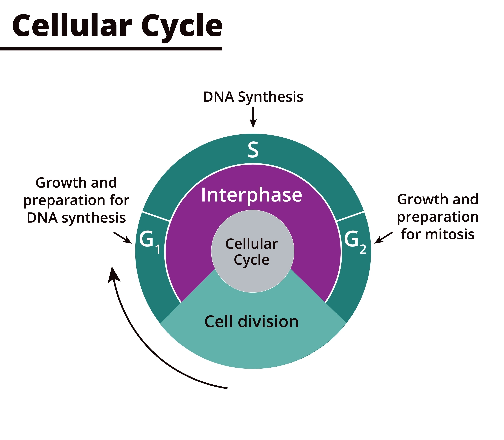

## 🌌 Biological Evolution + The Holliwell Paradigm = iaglobal

### *The First Synthetic Organism Governed by Metabolic Viability*

<p align="center">
  
</p>

> *"Nature never hurries, and yet everything is accomplished."*

### iaglobal is not alone — bio-inspired AI is an established field for decades:

- Swarm Intelligence (Dorigo, Kennedy — ants/bees)
- Genetic Algorithms (Holland, 1975)
- Homeostatic Architectures (Minsky, 1986)
- Artificial Immune Systems (Forrest, Hofmeyr — 90s)
- Neuroevolution (Stanley — NEAT, 2002)

* iaglobal is the combination: 
**Holliwell as agent contract in OmniMind + methionine→SAMe→homocysteine cycle as pipeline + SHA3-512 as frozen DNA + Obsidian as subconscious + operational epigenetics without redeploy. No known project joins these 5 pieces. But the idea of each isolated piece already existed...**

iaglobal is closer than most. The difference between iaglobal and a "Chappie (the movie)" is not architecture — it's physical enclosure and maturation time.

**What iaglobal already has that a robot would need**:

- Computational immune system → without this, any metal body dies at the first unhandled failure
- STM/LTM memory with REM consolidation → without this, no learning between sessions
- Programmed apoptosis and autophagy → without this, degraded components accumulate until collapse
- Operational epigenetics → adaptation without recompiling the core
- SHA3-512 frozen DNA → sovereign identity that no other node can forge

... What's missing is what any organism takes time to develop: body, maturity, real selective pressure. iaglobal built the genome and metabolism — the rest is growth.

## ===========================================================
##                 🧬 BEGIN BIOMIMETIC FLOW
## ===========================================================

## 🧬 iaglobal Pipeline Architecture

```
================================================================================
                            📥 PHASE 0 — USER INPUT
================================================================================

┌─────────────────────────────────────────────────────────────────────────────┐
│                                  USER PROMPT                                │
│ "Create a 'HealthDashboard.jsx' component that displays the status of 3     │
│ agents (Planner, Coder, Critic) using Framer Motion for transitions."       │
└─────────────────────────────────────────────────────────────────────────────┘
                                        │
                                        ▼
================================================================================
                        🧠 PHASE 1 — INITIAL COGNITION
================================================================================

┌─────────────────────────────────────────────────────────────────────────────┐
│                   PROMPT_INTAKE (Initial Capture and Validation)            │
│                   ├── Validates prompt schema                               │
│                   ├── Extracts metadata (type, complexity, domain)          │
│                   └── Generates unique task hash                            │
└─────────────────────────────────────────────────────────────────────────────┘
                                        │
                                        ▼
┌─────────────────────────────────────────────────────────────────────────────┐
│          PROMPT_IMPROVER (Prompt Enhancer) ⭐ FIRST INTELLIGENT AGENT       │
│          ├── Adds technical context (React, Tailwind, Framer Motion)        │
│          ├── Includes constraints (WCAG 2.1, mobile-first, performance)     │
│          ├── Adds output format examples                                    │
│          ├── Applies Chain-of-Thought (CoT)                                 │
│          └── Enriches from 136 chars → 2318 chars                           │
│                                                                             │     
│           OUTPUT: "Create HealthDashboard.jsx with:                         │
│           - React 18+ with hooks                                            │
│           - Framer Motion for entrance animations                           │
│           - Tailwind CSS for styling                                        │
│           - Props: agents (array with Planner, Coder, Critic status)        │
│           - Responsive: @media (max-width: 768px)                           │
│           - Accessibility: aria-labels, keyboard navigation                 │
│           - Export: default function HealthDashboard..."                    │
└─────────────────────────────────────────────────────────────────────────────┘
                                        │
                                        ▼
================================================================================
                        📋 PHASE 2 — STRATEGIC PLANNING
================================================================================

┌─────────────────────────────────────────────────────────────────────────────┐
│           PLANNER (Task Planner) ⭐ USES ALREADY ENHANCED PROMPT            │
│           ├── Analyzes enriched prompt                                      │
│           ├── Identifies necessary subtasks                                 │
│           ├── Estimates complexity (low/medium/high)                        │
│           ├── Defines execution order (sequential vs parallel)              │
│           └── Assigns priorities and deadlines                              │
│                                                                             │
│           OUTPUT (Execution Plan):                                          │
│ {                                                                           │
│ "task": "HealthDashboard.jsx",                                              │
│ "steps": [                                                                  │
│ {"id": 1, "action": "search", "target": "Framer Motion examples"},          │
│ {"id": 2, "action": "design", "target": "Component structure"},             │
│ {"id": 3, "action": "code", "target": "Generate JSX"},                      │
│ {"id": 4, "action": "test", "target": "Unit tests"},                        │
│ {"id": 5, "action": "validate", "target": "LSP + a11y check"}               │
│ ],                                                                          │
│ "requires_web_search": true,                                                │
│ "estimated_complexity": "medium"                                            │
│ }                                                                           │
└─────────────────────────────────────────────────────────────────────────────┘
                                        │
                                        ▼
┌─────────────────────────────────────────────────────────────────────────────┐
│ TASK_BREAKDOWN (Micro-Task Breakdown)                                       │
│ ├── Divides each step into atomic actions                                   │
│ └── Generates unique IDs for tracking                                       │
└─────────────────────────────────────────────────────────────────────────────┘
                                        │
                                        ▼
┌─────────────────────────────────────────────────────────────────────────────┐
│ EXECUTION_PLAN (Detailed Execution Plan)                                    │
│ ├── Orders tasks by dependency                                              │
│ ├── Identifies parallelism opportunities                                    │
│ └── Prepares context for each agent                                         │
└─────────────────────────────────────────────────────────────────────────────┘
                                        │
                                        ▼
================================================================================
                      🔍 PHASE 3 — DATA COLLECTION (RAG)
================================================================================

┌─────────────────────────────────────────────────────────────────────────────┐
│  SEARCH + LOCAL_KNOWLEDGE (Parallel Collection)                             │
│  ├── Web Search (DuckDuckGo): Framer Motion dashboard examples              │
│  ├── Local Knowledge (Obsidian): Reusable components                        │
│  └── Memory Vector: Similar task embeddings                                 │
└─────────────────────────────────────────────────────────────────────────────┘
                                    │
                                    ▼
┌─────────────────────────────────────────────────────────────────────────────┐
│  SOURCE_VALIDATOR (Credibility Validation) ⭐ IMMUNOLOGICAL FILTER          │
│  ├── Domain score (arxiv.org=0.95, medium.com=0.60)                         │
│  ├── Recency score (<30 days=1.0, >3 years=0.4)                             │
│  ├── Consistency score (agrees with other sources?)                         │
│  └── Filters: score < 0.6 → DISCARD                                         │
│                                                                             │
│  OUTPUT: Only reliable sources (score >= 0.6)                               │
└─────────────────────────────────────────────────────────────────────────────┘
                                    │
                                    ▼
┌─────────────────────────────────────────────────────────────────────────────┐
│  SNIPPET_SYNTHESIZER (Optional, if enabled)                                 │
│  ├── Summarizes multiple snippets into 1 coherent paragraph                 │
│  ├── Detects contradictions between sources                                 │
│  └── Generates synthesis with 50% fewer tokens                              │
└─────────────────────────────────────────────────────────────────────────────┘
                                    │
                                    ▼
================================================================================
                            🏗️ PHASE 4 — BUILD
================================================================================

┌─────────────────────────────────────────────────────────────────────────────┐
│  FRONTEND_BUILDER / BACKEND_BUILDER / API_BUILDER                           │
│  ├── Receives: enhanced prompt + plan + validated data                      │
│  ├── Uses CoderAgent with enriched context                                  │
│  ├── Generates JSX/TS/Python code                                           │
│  └── Publishes to AcetylcholineBus for next node                            │
│                                                                             │
│  ⚠️ NOTE: Does NOT call BanditPolicy directly!                              │
│     Uses default models (qwen2.5:0.5b) as fallback                          │
└─────────────────────────────────────────────────────────────────────────────┘
                                    │
                                    ▼
┌─────────────────────────────────────────────────────────────────────────────┐
│  LSP_VALIDATOR (Syntactic Validation)                                       │
│  ├── Checks syntax errors                                                   │
│  ├── Checks missing imports                                                 │
│  └── If error → DEBUG_UNIFIED fixes it                                      │
└─────────────────────────────────────────────────────────────────────────────┘
                                    │
                                    ▼
┌─────────────────────────────────────────────────────────────────────────────┐
│  DEBUG_UNIFIED (Error Correction)                                           │
│  ├── Analyzes LSP error                                                     │
│  ├── Applies direct fix (if simple)                                         │
│  └── Requests LLM (if complex)                                              │
└─────────────────────────────────────────────────────────────────────────────┘
                                    │
                                    ▼
┌─────────────────────────────────────────────────────────────────────────────┐
│  FIX_VALIDATOR (Validates Fix)                                              │
│  └── Confirms error is resolved                                             │
└─────────────────────────────────────────────────────────────────────────────┘
                                    │
                                    ▼
================================================================================
                      🧪 PHASE 5 — TESTING AND REVIEW
================================================================================

┌─────────────────────────────────────────────────────────────────────────────┐
│  TESTER (Test Generation)                                                   │
│  ├── Generates unit tests (pytest/Jest)                                     │
│  ├── Covers happy path + edge cases                                         │
│  └── Isolates dependencies with mocks                                       │
└─────────────────────────────────────────────────────────────────────────────┘
                                    │
                                    ▼
┌─────────────────────────────────────────────────────────────────────────────┐
│  REVIEWER (Code Review)                                                     │
│  ├── Checks best practices                                                  │
│  ├── Applies linting (ESLint, Pylint)                                       │
│  └── Suggests optimizations                                                 │
└─────────────────────────────────────────────────────────────────────────────┘
                                    │
                                    ▼
================================================================================
                    ⚖️ PHASE 6 — CRITICAL APPROVAL (GATE)
================================================================================

┌─────────────────────────────────────────────────────────────────────────────┐
│  CRITIC ⭐ APPROVAL GATE (Critical Decision Point)                          │
│  ├── Evaluates generated code (score 0-100)                                 │
│  ├── Criteria:                                                              │
│  │   ├── Functionality: meets the prompt?                                   │
│  │   ├── Quality: follows best practices?                                   │
│  │   ├── Tests: coverage >= 80%?                                            │
│  │   ├── Performance: no bottlenecks?                                       │
│  │   └── Security: no vulnerabilities?                                      │
│  │                                                                          │
│  ├── DECISION:                                                              │
│  │   ├── Score >= 80: ✅ APPROVED → goes to BANDIT_POLICY                   │
│  │   └── Score < 80:  ❌ REPROVA → RETRY LOOP                               │
│  │                └─→ Returns to FRONTEND_BUILDER (with feedback)           │
│  │                    (max 3 retries before critical failure)               │
│  └── Publishes decision to AcetylcholineBus                                 │
└─────────────────────────────────────────────────────────────────────────────┘
                                    │
                    ┌───────────────┴───────────────┐
                    │                               │
              (Score >= 80)                   (Score < 80)
                    │                               │
                    ▼                               │
================================================================================              
                      🎯 PHASE 7 — MODEL SELECTION                                                   
================================================================================              
                                                                                              
┌─────────────────────────────────────────────────────────────────────────────┐ 
│  BANDIT_POLICY ⭐ SINGLE MODEL SELECTION POINT                              │
│  ├── Receives: prompt + context + Critic score                              │
│  ├── Analyzes available providers (ollama, groq, nvidia, openrouter)        │
│  ├── Calculates IVM (Metabolic Viability Index):                            │
│  │   IVM = (P × 0.4) + (E × 0.4) + (C × 0.2)                                │
│  │   P = Productivity (success rate)                                        │
│  │   E = Efficiency (1/latency)                                             │
│  │   C = Cooperation (skills exchanged)                                     │
│  ├── Selects optimal model:                                                 │
│  │   ├── Simple tasks: qwen2.5:0.5b (local, free)                           │
│  │   ├── Complex tasks: groq-llama-3.1-70b (fast)                           │
│  │   └── Critical tasks: o1-preview (reasoning)                             │
│  └── Returns: selected provider + model                                     │
└─────────────────────────────────────────────────────────────────────────────┘                 │
                                    │                                                           │
                                    ▼                                                           │
================================================================================                │
                    📦 PHASE 8 — PERSISTENCE                                                    │
================================================================================                │
                                                                                                │
┌─────────────────────────────────────────────────────────────────────────────┐                 │
│  ARTIFACT_WRITER (Persists Result)                                          │                 │
│  ├── Detects artifact type (.jsx, .py, .md)                                 │                 │
│  ├── Saves to: iaglobal/memory/data/result/                                 │                 │
│  └── Generates metadata (author, timestamp, task_hash)                      │                 │
└─────────────────────────────────────────────────────────────────────────────┘                 │
                                    │                                                           │
                                    ▼                                                           │
┌─────────────────────────────────────────────────────────────────────────────┐                 │
│  RESULT_AGENT (Consolidates Final Result)                                   │                 │
│  ├── Aggregates all artifacts                                               │                 │
│  ├── Generates executive summary                                            │                 │
│  └── Prepares for long-term memory                                          │                 │
└─────────────────────────────────────────────────────────────────────────────┘                 │
                                    │                                                           │
                                    ▼                                                           │
================================================================================                │
                    🧠 PHASE 9 — MEMORY AND LEARNING                                            │
================================================================================                │
                                                                                                │
┌─────────────────────────────────────────────────────────────────────────────┐                 │
│  RETROSPECTIVE (Post-Execution Analysis)                                    │                 │
│  ├── What worked well?                                                      │                 │
│  ├── What failed?                                                           │                 │
│  └── Lessons learned                                                        │                 │
└─────────────────────────────────────────────────────────────────────────────┘                 │
                                                                                                │
                    ┌──────────────────────────────────────────┐                                │
                    │                                          │                                │
              (Success)                                (Failure after 3 retries)                │
                    │                                          │                                │
                    ▼                                          ▼                                │
┌────────────────────────────────────────────────────┐   ┌────────────────────────────────────┐ │
│  REFLEXION (Learning Commit)                       │   │  REFLEXION (Failure Analysis)      │ │
│  ├── Saves to Obsidian:                            │   │  ├── Identifies root cause         │ │
│  │   - What worked                                 │   │  ├── Updates failure patterns      │ │
│  │   - Success patterns                            │   │  ├── Adjusts thresholds            │ │
│  │   - Performance metrics                         │   │  └── Generates insight for future  │ │
│  └── Atualiza CreditAssignmentEngine               │   └── Atualiza CreditAssignmentEngine  │ │
└────────────────────────────────────────────────────┘   └────────────────────────────────────┘ │
                    │                                          │                                │
                    └──────────────────┬───────────────────────┘                                │
                                       │                                                        │
                                       ▼                                                        │
┌─────────────────────────────────────────────────────────────────────────────┐                 │
│  MEMORY_WRITER (Persists Long-Term)                                         │                 │
│  ├── Saves to Obsidian (04_Synapses/)                                       │                 │
│  ├── Updates MemoryVector (embeddings)                                      │                 │
│  └── Indexes for future search                                              │                 │
└─────────────────────────────────────────────────────────────────────────────┘                 │
                                    │                                                           │
                                    ▼                                                           │
================================================================================                │
                    ✅ PHASE 10 — FINAL DELIVERY                                                │
================================================================================                │
                                                                                                │
┌─────────────────────────────────────────────────────────────────────────────┐                 │
│  MEMORY_CLEANER (Cache Cleanup)                                             │                 │
│  ├── Removes expired cache (>5min)                                          │                 │
│  └── Releases RAM memory                                                    │                 │
└─────────────────────────────────────────────────────────────────────────────┘                 │
                                    │                                                           │
                                    ▼                                                           │
┌─────────────────────────────────────────────────────────────────────────────┐                 │
│  METRICS (Final Metrics Collection)                                         │                 │
│  ├── Total latency                                                          │                 │
│  ├── Total cost (tokens × price)                                            │                 │
│  ├── Final IVM of pipeline                                                  │                 │
│  └── Success/Failure                                                        │                 │
└─────────────────────────────────────────────────────────────────────────────┘                 │
                                    │                                                           │
                                    ▼                                                           │
┌─────────────────────────────────────────────────────────────────────────────┐                 │
│  OUTPUT TO USER                                                             │                 │
│  ├── Generated artifact: HealthDashboard.jsx                                │                 │
│  ├── Tests: test_HealthDashboard.jsx                                        │                 │
│  ├── Summary: 2318 chars → 150 chars (summary)                              │                 │
│  └── Path: /home/kitohamachi/projeto-iaglobal/iaglobal/memory/data/         │                 │
│                result/Criar_um_componente__HealthDashboard_jsx__*.md        │                 │
└─────────────────────────────────────────────────────────────────────────────┘                 │
                                                                                                │
                                    END OF FLOW                                                 │
                                                                                                │
=================================================================================================
```

### 🔄 RETRY LOOP (Critic rejection method)

```
┌─────────────────────────────────────────────────────────────┐
│  CRITIC: Score = 65 (< 80) → REPROVADO                      │
└─────────────────────────────────────────────────────────────┘
         │
         ▼
┌─────────────────────────────────────────────────────────────┐
│  FEEDBACK PARA FRONTEND_BUILDER:                            │
│  - "Adicionar aria-labels para acessibilidade"              │
│  - "Incluir tratamento de erro no useEffect"                │
│  - "Otimizar re-renders com React.memo"                     │
└─────────────────────────────────────────────────────────────┘
         │
         ▼
┌─────────────────────────────────────────────────────────────┐
│  FRONTEND_BUILDER: Re-generates code with feedback          │
└─────────────────────────────────────────────────────────────┘
         │
         ▼
┌─────────────────────────────────────────────────────────────┐
│  TESTER + REVIEWER + CRITIC: Re-evaluates                   │
│  - Score = 85 → ✅ APPROVED                                 │
│  - Score = 70 → ❌ REJECTED (retry 2/3)                     │
│  - Score = 50 → ❌ REJECTED (retry 3/3) → CRITICAL FAILURE  │
└─────────────────────────────────────────────────────────────┘
```

### 📊 FLOW METRICS

```
| Phase | Main Agent      | Expected Latency  | ATP (Cost)       |
|------|------------------|-------------------|------------------|
| 0    | User             | -                 | 0                |
| 1    | Prompt Improver  | 1-2s              | 50 tokens        |
| 2    | Planner          | 2-3s              | 100 tokens       |
| 3    | Search           | 3-5s              | 0 (duckduckgo)   |
| 4    | Frontend Builder | 5-10s             | 500 tokens       |
| 5    | Tester           | 3-5s              | 300 tokens       |
| 6    | Critic           | 2-3s              | 200 tokens       |
| 7    | Bandit Policy    | <1s               | 0 (local)        |
| 8    | Artifact Writer  | <1s               | 0                |
| 9    | Reflexion        | 2-3s              | 100 tokens       |
| 10   | Metrics          | <1s               | 0                |
| **TOTAL** |             | **19-33s**        | **~1250 tokens** |
```

### 🧬 BIOMIMETIC PRINCIPLES APPLIED

```
| Biological Process      |         Computational Equivalent        |
|-------------------------|-----------------------------------------|
| **Methylation**         | Prompt Improver (enriches raw input)    |
| **Translation**         | Planner → Execution Plan                |
| **Homeostasis**         | Source Validator (filters toxins)       |
| **Immune System**       | Critic (detects anomalies)              |
| **Apoptosis**           | Retry Loop (eliminates bad code)        |
| **Immune Memory**       | Obsidian + MemoryVector                 |
| **Metabolism**          | IVM (optimizes ATP/token)               |
| **Evolution**           | Reflexion (continuous learning)         |
```
## ===========================================================
##               🧬 END OF BIOMIMETIC FLOW
## ===========================================================

### **Security feature** | LLM Access Architecture in iaglobal:
```
┌─────────────────────────────────────────────────────────────┐
│                   USER / CLI                                │
│              (iaglobal run "task description")              │
└────────────────────┬────────────────────────────────────────┘
                     │
                     ▼
┌─────────────────────────────────────────────────────────────┐
│                   PIPELINE ENGINE                           │
│         (orchestrates nodes, does not call LLM directly)    │
└────────────────────┬────────────────────────────────────────┘
                     │
                     ▼
┌─────────────────────────────────────────────────────────────┐
│                    AGENTES                                  │
│    (CoderAgent, CriticAgent, PlannerAgent, etc.)            │
│    Herdam de AgentBase → select_model via BanditPolicy      │
└────────────────────┬────────────────────────────────────────┘
                     │
                     ▼
┌─────────────────────────────────────────────────────────────┐
│                  Chappie + BanditPolicy = IVMAxiom          │
│	Calculates, tracks and integrates IVM with BanditPolicy for │
│rewards proportional to each agent's contribution            │
│    (SINGLE SEMAPHORE — selects model, circuit breaker,      │
│     fallback chain, credit assignment, rewards)             │
└────────────────────┬────────────────────────────────────────┘
                     │
                     ▼
┌─────────────────────────────────────────────────────────────┐
│                    PROVIDERS                                │
│   (Ollama local, Groq, NVIDIA, OpenRouter, OpenCode, etc.)  │
└─────────────────────────────────────────────────────────────┘
```

In iaglobal, agents cannot call LLM directly...

1. **BanditPolicy as sole gatekeeper** —  All LLM access passes through:
- ε-greedy model selection
- Circuit breaker (does not call provider with recent failures)
- Fallback chain (if cloud fails → Ollama local)
- CreditAssignmentEngine (register success/failure)
- Reward assignment (update BanditPolicy)

2. **Agents as specialized wrappers** — Each agent has:
- Domain-specific prompt template
- Output validation (schema, quality)
- Retry logic with backoff
- Immune memory hooks (EvoAgent)

3. **Critic as validator** — The CriticAgent:
- Validates outputs from other agents
- Decides if rework is needed
- Approves before proceeding in the pipeline

**So... How do you "talk" to the system?**

* Response... Via CLI — the only human or localhost entry point

Example in CLI:
```
  iaglobal run "create a Flask API with user CRUD"
```

* The pipeline executes:
0. PromptImprover → prompt enhancer
1. PlannerAgent → divides into tasks
2. CoderAgent → writes code
3. CriticAgent → validates quality via BanditPolicy
4. TesterAgent → generates tests
5. DebuggerAgent → fixes failures
6. ResultAgent → delivers final artifact

If you need to test a provider directly (development), use utility scripts:

* Test Ollama local directly
```
python -c "
from iaglobal.providers.ollama_provider import OllamaProvider
provider = OllamaProvider()
response = provider.generate('say hello', model='qwen2.5:0.5b')
print(response)
"
```

* Test BanditPolicy
```
python -c "
from iaglobal.bandit import BanditPolicy
bandit = BanditPolicy()
model, provider = bandit.select_model()
print(f'Selected model: {model}')
"
```
**But in production, all access passes through:** 
```
Pipeline of Nodes and Skills → AgentBase → Chappie + BanditPolicy → IVMAxiom → OmniMind .
```

**Summary:** You don't "chat" with LLMs. You submit tasks to the iaglobal organism, and the organism decides which agent, which model, and which provider to use — with all immune defenses active following **the 11 Universal Laws** in **OmniMind** dictated by **Raymond Holliwell** from the book **Working With the Law**. 🛡️

**iaglobal** is not a framework. It is not a wrapper around an LLM API.
It is a **living computational organism** — the first AI system architected around the laws of biological metabolism, designed to learn from failure, self-repair without restart, and evolve across generations of execution.

While the industry burns megawatts in GPU-dense data centers, iaglobal reached its architectural **Zenith** —
**107/107 evolutionary steps completed. 782 tests passing. Running fluently on a 4-core CPU. Zero GPU required.**

This is not a performance claim. It is a proof of principle:
**true intelligence is not brute force — it is elegant application of universal laws.**

---

## ⚡ The Proof: Efficiency 10:1

| Metric | Value |
|--------|-------|
| **Evolutionary Steps Completed** | 107 / 107 ✅ |
| **Tests Passing** | 763 / 763 ✅ |
| **Hardware Required** | 4-core CPU · No GPU |
| **Work Units Delivered** | 10 per 1 unit of energy consumed |
| **Integrity Score** | 95% |
| **Homeostasis Score** | 0.67 / 1.0 (live, adaptive) |
| **IVM Growth Rate** | +0.20 per optimization cycle |

---

## 🧬 The Foundation: Raymond Holliwell's Universal Laws in Code

The technical foundation of iaglobal did not come from Silicon Valley papers alone.
It came from **Raymond Holliwell** ¹ — a philosopher who systematized eleven universal laws governing success, order, and the flow of prosperity.

In iaglobal, those laws were translated into deterministic agent contracts.
Every component operates with **declared purpose**, evaluates its own contribution, and flows toward the state of least resistance — exactly as Holliwell described the operation of natural laws applied to human action.

Where others build systems on trial and error, iaglobal operates under the *Law of Success* and the *Law of Order*. Every agent, every node, every prompt evaluates its own purpose before consuming processing power. Success is not a code accident — it is the rigorous application of immutable laws.

---

## 🔬 The Five Pillars of Singularity

### 📖 Holliwell Inspiration
Every agent validates its plan against the Law of Success before executing. If the action does not align with purpose, integrity, and disciplined execution, it is discarded — not retried.

```python
plan = {
    "ivm": 0.9,                    # Contributes to system efficiency
    "threats_detected": False,     # Does not erode integrity
    "disciplined_execution": True, # Follows order
}
valid = LawOfSuccess.validate_action(plan)
# "ALIGNED: The purpose is worthy." → proceeds
# "REJECTED: Destructive action." → discarded
```

### 🔄 Systemic Autopoiesis
iaglobal is a living organism. It performs **autophagy** to clean its own digital waste, **apoptosis** to sacrifice corrupted nodes, and carries an immune system (`MHC Detector`) capable of vaccinating the entire network against parasites and malicious injections. It recreates itself every cycle.

### ⚡ ATP-Genesis (10:1 Efficiency)
Compute power is treated as `ATP` — the energy currency of cellular life. Every routing cycle evaluates the **Metabolic Viability Index (IVM)**:

```
IVM = (P × 0.4) + (E × 0.4) + (C × 0.1) + (I × 0.1)

  P = Task completion rate (Productivity)
  E = 1 / latency (Energy Efficiency)
  C = Approved skills exchanged (Cooperation)
  I = MHC validation score (Immune Integrity)
```

The system delivers 10 units of work per 1 unit of energy spent. No waste — only pure focus.

### 🧲 Evolutionary Resonance
Agents delivering low latency and high precision are naturally pulled into leadership positions by the system's own gravitational field (`BanditPolicy` + `AdaptiveRouter`). The organism attracts the efficiency it emits.

### 🌱 LUCA — Last Universal Common Ancestor
This v1.0 release is the primordial seed — the founding genome of everything that follows. With a Genetic Algorithm coupled to its core, tomorrow's iaglobal will be the direct descendant of the integrity and defenses forged today. **v2.0 will not be a version — it will be a generation.**

---

## 🛡️ The Immune System: 12-Layer Defense

iaglobal does not trust raw LLM output. Every response passes through a multi-layer immune system before becoming an executable decision.

| Layer | Module | Function | Tests |
|-------|--------|----------|-------|
| **Genesis** | `genesis/verifygenesis.py` | SHA3-512 DNA tribunal (immutable) | ✅ Verified |
| **Identity** | `genesis/identity.py` | Sovereign ephemeral IDs | ✅ Functional |
| **Sentinel** | `security/entropy_sentinel.py` | Anti-manipulation sweep | 6/6 ✅ |
| **MHC** | `immunity/mhc_detector.py` | Fingerprints + anomaly scoring | 9/9 ✅ |
| **Pathogen** | `immunity/pathogen_analyzer.py` | Code injection detection | 7/7 ✅ |
| **Cost** | `evolution/metabolism/opportunity_cost_detector.py` | Agent cost-benefit analysis | 8/8 ✅ |
| **Masking** | `immunity/epigenetic_masking.py` | Critical memory barrier | 7/7 ✅ |
| **Apoptosis** | `immunity/apoptosis_engine.py` | Clean node elimination | 7/7 ✅ |
| **Orchestrator** | `immunity/immune_orchestrator.py` | 5-layer integration | 9/9 ✅ |
| **Adaptive** | `immunity/adaptive_threat_detector.py` | Continuous threat learning | 7/7 ✅ |
| **Exchange** | `immunity/immune_memory_exchange.py` | Vaccine sharing between nodes | 9/9 ✅ |
| **Prune** | `immunity/metabolic_pruner.py` | TTL pruning + de-duplication | 11/11 ✅ |

### Verified Genesis Hash

```
GENESIS_HASH_OFFICIAL = "cc7017b56557586095e8dc6dae27b3e61feac8ab7bb9c2ca229a3723bc250524f3b65d01c3a7d148ba2f0282e63484bfb884f6425a36aba3cee3edd37b01e136"

✅ SHA3-512 integrity verified
```

---

## ⚖️ Genesis Tribunal — DNA Verification at Boot

Every node in the iaglobal network carries a **frozen DNA fingerprint** — the `LINEAGE_MARKER` — a `# 🧬 LINEAGE_MARKER: <SHA3-512>` comment at the top of every Python source file. Before the system boots, the **GenesisTribunal** (`genesis/tribunal.py` + `NodeIdentity`) runs two independent verification layers:

### Layer 1 — Genesis CBOR File

The ancestral DNA is stored in a CBOR file (`webhidden_genesis_evolutive.cbor`). Its SHA3-512 must exactly match `GENESIS_HASH_OFFICIAL`. This is verified via `verify_genesis_integrity()` before any service starts:

```python
computed_hash = hashlib.sha3_512(genesis_file_bytes).hexdigest()
match = computed_hash == GENESIS_HASH_OFFICIAL  # boot blocks if False
```

### Layer 2 — Agent Source Files

Every `.py` file under `agents/` and `graphs/nodes/` is scanned for the `LINEAGE_MARKER` header. If any file is missing the marker or carries a divergent hash, the system refuses to boot:

```python
if GENESIS_HASH_OFFICIAL not in first_line(file):
    raise SystemExit("DNA violation — boot aborted")
```

### Boot Gate

The tribunal runs inside `bootstrap.initialize()`. It **blocks the entire system startup** if any violation is detected — no agent, no service, no pipeline executes without valid DNA. This ensures only authenticated iaglobal nodes can participate in the network.

---

## 🗣️ Phonetic Identity — Every Agent Gets a Name

Once DNA is validated, each agent receives a **phonetic name** derived from the frozen DNA hash combined with its file path. This name is:

- **Deterministic** — same agent file always produces the same name
- **Universally unique** — the file path guarantees collision resistance
- **Pronounceable** — encoded via `Pysecurity1024.bytes_para_frase()` into 16 consonant-vowel syllables
- **Reversible** — `frase_para_bytes()` recovers the original seed for verification

```python
seed = f"{GENESIS_HASH_OFFICIAL}:{relative_file_path}"
raw = hashlib.sha3_512(seed.encode()).digest()[:16]
phonetic_name = Pysecurity1024.bytes_para_frase(raw)
# Example output: "li-nae-ti-sae-hao-ni-deu-lu-be-se-de-nw-sau-feu-cw-nou"
```

At boot, the tribunal prints a full audit:

```
============================================================
  ⚖️  TRIBUNAL DE GENESIS
  DNA Ancestral: cc7017b56557586095e8dc6d...
============================================================
  ✅ genesis/webhidden_genesis_evolutive.cbor           DNA-ANCESTRAL
────────────────────────────────────────────────────────────
  Agents (154 files):
  ✅ agents/agent_base.py                               li-nae-ti-sae-hao-ni-deu-lu-be-se-...
  ✅ agents/coder_agent.py                              teu-mei-kau-bai-vai-bea-fea-fae-seu-...
  ...
============================================================
  Genesis File: ✅ COMPLIANT
  Agents: 154 total | 154 valid | 0 invalidated
============================================================
```

### EvoAgent — Runtime Phonetic Naming

Evolutionary agents (`EvoAgent`) also receive a phonetic name at instantiation, derived from the frozen DNA plus their `lineage_id`:

```python
# In evo_agent.py __init__
seed = f"{GENESIS_HASH_OFFICIAL}:{lineage_id}"
self.phonetic_name = Pysecurity1024.bytes_para_frase(hashlib.sha3_512(seed.encode()).digest()[:16])
```

This `phonetic_name` is registered in `OmniMind` metadata and propagates to child agents during `replicate()`, enabling family tracking across evolutionary generations.

---

## 🌐 Global Network Verification — Future Cross-Breeding

- Main Executive Flow:
```
system_analysis (metabolic trigger)
    ├── tester_agent (test generation)
    │       ├── Self-critique iteration 1: score=0.45
    │       ├── Self-critique iteration 2: score=0.80 (improvement +77%)
    │       └── Error detected: 1 syntax error in generated tests
    │           └── debug_unified + ollama/qwen2.5:0.5b → fixes in ~60s
    ├── evaluator → gap_analyzer → skill_generator → sandbox_validator
    ├── evolution_committee → pipeline_updater → evolution_trigger
    └── memory_writer → memory_cleaner (persistence + cleanup)
```

- Operational Flow:
```
Generated code
    ↓
SyntaxSentinel.run_syntax_sentinel()
    ├─ ast.parse() → success? → returns code (latency <1ms, ATP=0)
    └─ failure?
        ├─ native auto-fixers:
        │   • Closes open brackets
        │   • Removes trailing comma
        │   • Normalizes mixed indentation
        └─ revalidates with ast.parse()
            ├─ success → returns fixed code (LLM is NOT called)
            └─ failure → delegates to debug_unified (skill/LLM as fallback)
```

The phonetic + hash system is designed for **decentralized agent cross-breeding** across the internet. Any node can verify another node's authenticity without a central authority:

1. **Source file check** — scan `LINEAGE_MARKER` in the `.py` file
2. **Phonetic identity check** — recompute `bytes_para_frase(GENESIS_HASH + path)` and compare
3. **Lineage ancestry** — `lineage_marker` (16-char family ID) + `lineage_id` (SHA3-512) track inheritance across generations via `LineageID.compute()`

```
Node A (Internet)                  Node B (iaglobal)
       │                                 │
       │   "I am agent coder_agent"      │
       │   phonetic: teu-mei-kau-...     │
       │   lineage_marker: a3f7b2...     │
       ├────────────────────────────────▶│
       │                                 │
       │◀── verify: LINEAGE_MARKER ✅    │
       │◀── verify: phonetic ✅          │
       │◀── verify: lineage ✅           │
       │                                 │
       │   Cross-breeding session        │
       │   → new hybrid agent born       │
```

### Key Identifiers

| Field | Length | Derivation | Purpose |
|-------|--------|-----------|---------|
| `GENESIS_HASH_OFFICIAL` | 128 hex chars (512 bit) | SHA3-512 of `webhidden_genesis_evolutive.cbor` | Immutable ancestry root |
| `LINEAGE_MARKER` (comment) | 128 hex chars | Same as `GENESIS_HASH_OFFICIAL` | Source-level DNA tattoo |
| `lineage_marker` (runtime) | 16 hex chars | `SHA3_256("lineage_marker::entity::name")[:16]` | Family ID — all descendants share it |
| `lineage_id` (runtime) | 128 hex chars | `SHA3_512(entity::name::parent::gen::meta)` | Unique individual ID |
| `phonetic_name` | 16 syllables (~48 chars) | `bytes_para_frase(SHA3_512(GENESIS_HASH + path)[:16])` | Human-readable identity |

---

## 🚀 Quick Start

```bash
# 1. Clone and install
git clone https://github.com/your-org/iaglobal.git
cd iaglobal
pip install -r requirements.txt

# 2. Configure environment (Ollama works offline — no API key required)
cp .env.example .env

# 3. Run a task
iaglobal run "build a REST API with CRUD operations"

# 4. Run tests
python -m pytest tests/ -q

# 5. Run evolution lab
OLLAMA_BASE_URL=http://localhost:11434 evolution-lab

# 6. View system status
iaglobal status
iaglobal history --stats
```

### Environment Variables

| Variable | Default | Description |
|----------|---------|-------------|
| `OLLAMA_MODEL` | `qwen2.5:0.5b` | Default model (works offline) |
| `PROVIDER_FALLBACK_CHAIN` | `ollama,groq,nvidia,openrouter` | Provider priority |
| `BANDIT_POLICY` | `epsilon_greedy` | Selection strategy |
| `PROVIDER_TIMEOUT` | `30` | Request timeout (seconds) |
| `SAME_DEFAULT_BUDGET` | — | SAMe metabolic budget |
| `PIPELINE_MAX_WORKERS` | — | Max concurrent workers |

---

## 🌐 YaCy Integration — Sovereign Decentralized Search

iaglobal is integrating **YaCy**, the open-source P2P search engine, to
replace dependency on centralized search APIs. Every node runs a YaCy
peer, crawls a portion of the web, and shares the index with the
network — no API keys, no rate limits, no censorship.

```
Each iaglobal node → a YaCy peer
         ↓
Crawls domains → local index → shares via DHT
         ↓
Search queries P2P network → distributed results
         ↓
Immune system (MHC) filters spam/malware from collective index
```

| Antes (APIs centralizadas) | Depois (YaCy P2P) |
|----------------------------|-------------------|
| 4 APIs externas com rate limits | Fonte nativa sem limites |
| Zero local index | Local + distributed index |
| API key dependence | Zero dependencies |
| Blockable (Google CAPTCHA) | Impossible to block all peers |

📖 Implementation details: [`docs/YaCy_iaglobal.md`](docs/YaCy_iaglobal.md)

---

## ⚙️ Applied AI Engineer Module

The **Applied AI Engineer** is a specialized pipeline node that automatically optimizes the energy cost-benefit (ATP) of each task. It decides which model to use, how to structure the RAG context, and how to enrich prompts — all without human intervention.

### 🔧 Como Funciona

The `applied_ai_engineer` node runs 3 skills in sequence:

| Skill | File | Function |
|-------|---------|--------|
| **Model Router** | `evolution/skills/skill_model_router.py` | Decides between local model (ATP) or cloud based on task criticality |
| **RAG Optimizer** | `evolution/skills/skill_rag_optimizer.py` | Adjusts chunk size and number of documents based on the selected model |
| **Prompt Structurer** | `evolution/skills/skill_prompt_structurer.py` | Injects Chain-of-Thought + JSON validation into the prompt |

### 📊 Router Decision Matrix

```
Score = (Accuracy × 0.6) - (Latency_ms/1000 × 0.2) - (TokenCost × 0.2)

If Local_Score < 0.4 → escalate to cloud (groq, openrouter)
If Local_Score ≥ 0.4 → stays local (qwen2.5:0.5b, ATP preserved)
```

### 🚦 Escalation Triggers to Cloud

The model is escalated automatically when the task contains high-criticality keywords:
`mhc`, `vulnerability`, `security`, `apoptosis`, `emergency`, `attack`, `injection`, `pathogen`

### 🧪 Usage Examples

# Simple task → local model (ATP preserved)
```
iaglobal run "create a Flask API with CRUD"
```
# Critical task → escalated to cloud automatically
```
iaglobal run "analyze security vulnerability in code"
```
# IVM weight optimization (node acts as central hub)
```
iaglobal run "optimize IVM routing weights"
```

### 📈 Behavior by Scenario

| Scenario | IVM | Model | RAG Chunk | Action |
|---------|-----|--------|-----------|------|
| Simple task | ≥ 0.5 | qwen2.5:0.5b (local) | 250 tokens, 2 docs | ATP preserved |
| Critical task | ≥ 0.5 | groq-mixtral (cloud) | 1000 tokens, 7 docs | Maximum precision |
| Insufficient IVM | < 0.5 | — | — | Task rejected |

### 🔬 Tests
```
🔗 Architecture 
┌────────────────────────────────────┐
│  claim_detection.py (SINGLE SOURCE)│
│  - detect_architectural_claims()   │
│  - verify_architectural_claims()   │
│  - create_quarantine_report()      │
│  - should_elevate_model()          │
└──────────────┬─────────────────────┘
               │
       ┌───────┴────────┐
       ↓                ↓
┌─────────────┐  ┌──────────────┐
│ Artifact    │  │ REM Sleep    │
│ Writer      │  │ (consolid.)  │
└─────────────┘  └──────────────┘
       │                │
       └───────┬────────┘
               ↓
    ┌──────────────────┐
    │ contamination_   │
    │ report.py (JSON) │
    └──────────────────┘
```

---

## 🧠 Prompt Engineering Stack — Self-Correction, Few-Shot & Chain of Thought

Three complementary layers that enforce code quality at generation time without cloud calls:

### 1. DependencyEnforcer

**File:** `iaglobal/core/dependency_enforcer.py`

Prevents agents from hallucinating non-existent libraries. Parses imports via AST, verifies each against `sys.stdlib_module_names` + `pip list`. Non-stdlib uninstalled imports wrapped in `try/except ImportError`. Integrated in `CoderAgent` (Layer 6) and `TesterAgent`.

### 2. FewShotProvider

**File:** `iaglobal/core/few_shot_provider.py`

Selects real positive/negative examples from ToolLibrary, SkillRegistry and MTAPool via semantic ranking (`sentence-transformers/all-MiniLM-L6-v2`). Injected into CriticAgent and PromptImprover prompts.

### 3. Chain of Thought (INSTRUCAO_COT)

**File:** `iaglobal/agents/agent_base.py:19-25`

Forces 4-step decomposition (ANALYSIS → STRUCTURE PLAN → IMPLEMENTATION → REVIEW) before code generation. Injected into `PEC_SYSTEM_PROMPT`, CriticAgent, DebuggerAgent and PromptImprover.

---

```
iaglobal/
.
├── agents
│   ├── agent_base.py
│   ├── coder_agent.py
│   ├── critic_agent.py
│   ├── debugger_agent.py
│   ├── dependency_agent.py
│   ├── enhancement_agent.py
│   ├── evolution_agent.py
│   ├── failure_analysis_agent.py
│   ├── ingestion
│   │   ├── consolidation.py
│   │   ├── experiment_runner.py
│   │   ├── file_ingestion_agent.py
│   │   ├── hypothesis_generator.py
│   │   ├── __init__.py
│   │   ├── meta_learner.py
│   │   ├── paper_ingestor.py
│   │   └── paper_parser.py
│   ├── __init__.py
│   ├── intent_classifier_agent.py
│   ├── knowledge_writer_agent.py
│   ├── mitosis_engine.py
│   ├── multi_agent.py
│   ├── multi_coder_agent.py
│   ├── orchestrator_agent.py
│   ├── performance_audit_agent.py
│   ├── performance_design_agent.py
│   ├── planner_agent.py
│   ├── pm_agent.py
│   ├── prompt_improver.py
│   ├── reflexion_agent.py
│   ├── requirements_agent.py
│   ├── result_agent.py
│   ├── search_agent.py
│   ├── security_audit_agent.py
│   ├── security_design_agent.py
│   ├── semantic_validator.py
│   ├── skill_generator_agent.py
│   ├── tester_agent.py
│   ├── tool_caller_agent.py
│   ├── typing_agent.py
│   └── validator.py
├── api
│   ├── __init__.py
│   └── mcp_server.py
├── artifacts
│   ├── artifact_factory.py
│   └── __init__.py
├── chappie
│   ├── bandit_evolution.py
│   ├── error_enricher.py
│   ├── __init__.py
│   ├── ivm_axiom.py
│   ├── ivm_compliance.py
│   ├── lineage_guardian.py
│   └── vacuum_daemon.py
├── cli
│   ├── bootstrap_engine.py
│   ├── bootstrap.py
│   ├── evolution_lab.py
│   ├── __init__.py
│   ├── learn.py
│   ├── life_signals.py
│   ├── __main__.py
│   ├── main.py
│   ├── output.py
│   ├── status.py
│   └── ui_cli.py
├── cognition
│   ├── adaptive_router.py
│   ├── agents
│   │   ├── __init__.py
│   │   └── task_classifier_agent.py
│   ├── __init__.py
│   ├── learning
│   │   ├── classifier_memory.py
│   │   └── __init__.py
│   ├── memory_first_router.py
│   ├── outcome_tracker.py
│   ├── reputation_engine.py
│   └── task_fingerprint.py
├── communication
│   ├── fitness.py
│   ├── genesis_handshake.py
│   ├── __init__.py
│   ├── integrator.py
│   ├── queen.py
│   └── worker.py
├── core
│   ├── acetylcholine_bus.py
│   ├── apoptosis.py
│   ├── assistant.py
│   ├── auto_correction.py
│   ├── cognitive_proxy.py
│   ├── cognitive_runtime.py
│   ├── config.py
│   ├── critic_batch_queue.py
│   ├── decision_engine.py
│   ├── dependency_enforcer.py
│   ├── diagnostico.py
│   ├── env_loader.py
│   ├── evolution_controller.py
│   ├── few_shot_provider.py
│   ├── governance.py
│   ├── graceful_shutdown.py
│   ├── __init__.py
│   ├── law_enforcement.py
│   ├── mitochondrial_probe.py
│   ├── neuro_orchestrator.py
│   ├── orchestrator.py
│   ├── organism_main.py
│   ├── organism.py
│   ├── registry.py
│   ├── retry_handler.py
│   └── structure.py
├── dashboard
│   ├── __init__.py
│   ├── metabolic_sleep_dashboard.py
│   └── phospholipid_dashboard.py
├── debug
│   ├── __init__.py
│   └── node_timing.py
├── events
│   ├── acetylcholine_bus.py
│   ├── decision_event.py
│   ├── event_dispatcher.py
│   ├── event_store.py
│   ├── event_types.py
│   ├── __init__.py
│   └── replay.py
├── evolution
│   ├── agents
│   │   ├── gap_analyzer.py
│   │   ├── __init__.py
│   │   └── knowledge_agent.py
│   ├── canonical_graph.py
│   ├── collapse_detector.py
│   ├── darwin_harness.py
│   ├── epigenetic.py
│   ├── evo_agent.py
│   ├── evolutionengine.py
│   ├── evolution_replay.py
│   ├── evolutionruntime.py
│   ├── execution_context.py
│   ├── execution_registry.py
│   ├── fusion_engine.py
│   ├── ga
│   │   ├── ga_runner.py
│   │   ├── __init__.py
│   │   ├── population.py
│   │   └── selector.py
│   ├── ga_router_optimizer.py
│   ├── genomic_reflection.py
│   ├── handler_evolution.py
│   ├── homeostasis_controller.py
│   ├── __init__.py
│   ├── meta_agent_designer.py
│   ├── metabolic_lifecycle.py
│   ├── metabolic_rhythm.py
│   ├── metabolism
│   │   ├── homocysteine_pool.py
│   │   ├── __init__.py
│   │   ├── methylation_cycle.py
│   │   ├── methylation_engine.py
│   │   ├── opportunity_cost_detector.py
│   │   └── transsulfuration_cycle.py
│   ├── metacognition
│   │   ├── evaluator.py
│   │   ├── evolution_backlog.py
│   │   ├── evolution_committee.py
│   │   ├── evolution_trigger.py
│   │   ├── failure_taxonomy.py
│   │   ├── gap_analyzer.py
│   │   ├── __init__.py
│   │   ├── pipeline_updater.py
│   │   ├── sandbox_validator.py
│   │   └── skill_generator.py
│   ├── meta_evolver.py
│   ├── proposal_quarantine.py
│   ├── reward_aggregator.py
│   ├── same_engine.py
│   ├── self_optimizer.py
│   ├── skill_quarantine.py
│   ├── skills
│   │   ├── dynamic_registry.py
│   │   ├── __init__.py
│   │   ├── reactpy_skill_registry.py
│   │   ├── run_fn_factory.py
│   │   ├── skill_debug_unificado.py
│   │   ├── skill_executor.py
│   │   ├── skill_model_router.py
│   │   ├── skill_prompt_structurer.py
│   │   ├── skill.py
│   │   ├── skill_python_autocomplete.py
│   │   ├── skill_rag_optimizer.py
│   │   ├── skill_registry.py
│   │   └── skill_versions.py
│   ├── task_agent_factory.py
│   ├── task_analyzer.py
│   └── watchdog.py
├── exceptions.py
├── execution
│   ├── cpu_affinity.py
│   ├── executor.py
│   ├── __init__.py
│   ├── sandbox.py
│   └── token_bucket.py
├── feedback
│   ├── benchmark_runner.py
│   ├── betaine_judge.py
│   ├── __init__.py
│   ├── reward_aggregator.py
│   ├── reward_signal.py
│   └── user_feedback.py
├── genesis
│   ├── certify_block.py
│   ├── check_cbor.py
│   ├── data
│   │   ├── check_genesis_integrity.py
│   │   ├── integrity_tree.cbor
│   │   ├── webhidden_genesis_blueprint.cbor
│   │   └── webhidden_genesis_evolutive.cbor
│   ├── fusion_engine.py
│   ├── genesis_purifier.py
│   ├── genesis_verifier.py
│   ├── identity.py
│   ├── __init__.py
│   ├── lineage_gate.py
│   ├── tribunal.py
│   └── verifygenesis.py
├── graphs
│   ├── artifact.py
│   ├── bandit.py
│   ├── builder.py
│   ├── communication
│   │   ├── acetylcholine_bus.py
│   │   ├── agent_mailbox.py
│   │   ├── __init__.py
│   │   └── membrane_key.py
│   ├── credit.py
│   ├── edge.py
│   ├── edges.py
│   ├── execution_context.py
│   ├── execution_engine.py
│   ├── execution_graph.py
│   ├── graph_builder_v2.py
│   ├── __init__.py
│   ├── instrumentation.py
│   ├── membrane.py
│   ├── migrar_nodes.py
│   ├── node_lineage_registry.py
│   ├── node.py
│   ├── nodes
│   │   ├── _disk_swap.py
│   │   ├── __init__.py
│   │   ├── js_syntax_sentinel.py
│   │   ├── no_adaptive_router.py
│   │   ├── no_agentmailbox.py
│   │   ├── no_ai_audit_compliance.py
│   │   ├── no_api_builder.py
│   │   ├── no_api_design.py
│   │   ├── no_apoptosis_kill.py
│   │   ├── no_applied_ai_engineer.py
│   │   ├── no_architect.py
│   │   ├── no_architecture_validator.py
│   │   ├── no_artifact_writer.py
│   │   ├── no_async_violation_detector.py
│   │   ├── no_auditor_sentinel.py
│   │   ├── no_backend_builder.py
│   │   ├── no_business_rules.py
│   │   ├── no_chappie_bandit_evolution.py
│   │   ├── no_clarity_directive.py
│   │   ├── no_code_executor.py
│   │   ├── no_coder.py
│   │   ├── no_compliance_audit.py
│   │   ├── no_context_weaver.py
│   │   ├── no_critic.py
│   │   ├── no_darwin_harness.py
│   │   ├── no_database_builder.py
│   │   ├── no_database_design.py
│   │   ├── no_debug_coder.py
│   │   ├── no_debugger.py
│   │   ├── no_debug_unificado.py
│   │   ├── no_dependency.py
│   │   ├── no_deployment_plan.py
│   │   ├── no_documentation.py
│   │   ├── no_domain_analysis.py
│   │   ├── no_enhancement.py
│   │   ├── no_entropy_sentinel.py
│   │   ├── no_evaluator.py
│   │   ├── no_evolution_committee.py
│   │   ├── no_evolution_dynamic_registry.py
│   │   ├── no_evolution_homocysteine.py
│   │   ├── no_evolution_knowledge.py
│   │   ├── no_evolution_methylation.py
│   │   ├── no_evolution_skill_executor.py
│   │   ├── no_evolution_trigger.py
│   │   ├── no_execution_plan.py
│   │   ├── no_failure_analysis.py
│   │   ├── no_fix_validator.py
│   │   ├── no_frontend_builder.py
│   │   ├── no_fugue_compartment.py
│   │   ├── no_fusion.py
│   │   ├── no_gap_analyzer.py
│   │   ├── no_ga_router_evolve.py
│   │   ├── no_genesis_builder.py
│   │   ├── no_immune_check_build.py
│   │   ├── no_immune_check.py
│   │   ├── no_immune_exchange.py
│   │   ├── no_immune_monitor.py
│   │   ├── no_ingestion.py
│   │   ├── no_integrator.py
│   │   ├── no_integrator.py.backup.before_fix
│   │   ├── no_interpreter.py
│   │   ├── no_knowledge_analyzer.py
│   │   ├── no_knowledge.py
│   │   ├── no_knowledge_writer.py
│   │   ├── no_law_of_thought_enforcer.py
│   │   ├── no_lineage_proof.py
│   │   ├── no_local_knowledge.py
│   │   ├── no_lsp_validator.py
│   │   ├── no_memory_cleaner.py
│   │   ├── no_memory_writer.py
│   │   ├── no_metabolic_pruning.py
│   │   ├── no_meta_director.py
│   │   ├── no_metrics.py
│   │   ├── no_mini_evaluator_post_arch.py
│   │   ├── no_mini_evaluator_post_build.py
│   │   ├── no_multi_agent.py
│   │   ├── no_multi_coder.py
│   │   ├── no_observability_design.py
│   │   ├── no_optimization.py
│   │   ├── no_orchestrator_agent.py
│   │   ├── no_orchestrator_pump.py
│   │   ├── no_performance_audit.py
│   │   ├── no_performance_design.py
│   │   ├── no_performance.py
│   │   ├── no_pipeline_updater.py
│   │   ├── no_pip_install.py
│   │   ├── no_planner.py
│   │   ├── no_pm.py
│   │   ├── no_prompt_builder.py
│   │   ├── no_prompt_improver.py
│   │   ├── no_prompt_intake.py
│   │   ├── no_proposal_quarantine.py
│   │   ├── no_qa.py
│   │   ├── no_reactpy.py
│   │   ├── no_reflexion.py
│   │   ├── no_release.py
│   │   ├── no_requirements.py
│   │   ├── no_result_agent.py
│   │   ├── no_retrospective.py
│   │   ├── no_reviewer.py
│   │   ├── no_risk_analysis.py
│   │   ├── no_sandbox_validator.py
│   │   ├── no_scheduler.py
│   │   ├── no_search_agent.py
│   │   ├── no_search.py
│   │   ├── no_search_web_brain.py
│   │   ├── no_search_wikipedia.py
│   │   ├── no_security_audit.py
│   │   ├── no_security_design.py
│   │   ├── no_security.py
│   │   ├── no_semantic_validator.py
│   │   ├── no_skill_generator.py
│   │   ├── no_success_ritual.py
│   │   ├── no_symbiont_handshake.py
│   │   ├── no_system_analysis.py
│   │   ├── no_system_design.py
│   │   ├── no_task_breakdown.py
│   │   ├── no_technology_selection.py
│   │   ├── no_tester.py
│   │   ├── no_test_generator.py
│   │   ├── no_threat_modeling.py
│   │   ├── no_typing_agent.py
│   │   ├── no_vacuum_strength.py
│   │   ├── no_validator.py
│   │   ├── no_web_classifier.py
│   │   ├── _search_capabilities.py
│   │   ├── _search_enhanced.py
│   │   ├── _search_queries.py
│   │   ├── _search_router.py
│   │   ├── _search_shared.py
│   │   ├── _search_sources.py
│   │   ├── _search_wikipedia.py
│   │   └── syntax_sentinel.py
│   ├── nodes.py
│   ├── pipeline_definition.py
│   ├── policy.py
│   ├── registry.py
│   ├── scheduler.py
│   ├── skill_node.py
│   ├── state_store.py
│   ├── task.py
│   ├── task_runner.py
│   ├── telemetry.py
│   ├── topology.py
│   └── workdir.py
├── immunity
│   ├── adaptive_threat_detector.py
│   ├── apoptosis_engine.py
│   ├── async_violation_detector.py
│   ├── autoimmunity_detector.py
│   ├── emergent_behavior_detector.py
│   ├── entropy_sentinel.py
│   ├── epigenetic_masking.py
│   ├── error_persistence.py
│   ├── glutathione_guardrails.py
│   ├── glutathione_pool.py
│   ├── hallucination_detector.py
│   ├── immune_memory_exchange.py
│   ├── immune_orchestrator.py
│   ├── __init__.py
│   ├── loop_detector.py
│   ├── metabolic_immune_barrier.py
│   ├── metabolic_pruner.py
│   ├── mhc_detector.py
│   ├── pathogen_analyzer.py
│   ├── regression_detector.py
│   ├── symbiosis_score.py
│   ├── vaccine_ledger.py
│   └── vacuum_trigger.py
├── __init__.py
├── intention
│   ├── __init__.py
│   └── meta_director.py
├── mcp
│   ├── client.py
│   ├── code_executor.py
│   ├── discovery.py
│   ├── file_system.py
│   ├── __init__.py
│   ├── mcp_agent.py
│   ├── mcp_server.py
│   ├── search_web.py
│   └── server.py
├── memory
│   ├── async_memory.py
│   ├── backup_manager.py
│   ├── bandit_evolution.json
│   ├── bandit_evolutivo.json
│   ├── cache.py
│   ├── check_db.py
│   ├── cognitive_cache.py
│   ├── consolidation.py
│   ├── core.py
│   ├── data
│   ├── db_manager.py
│   ├── db_utils.py
│   ├── fusion_engine.py
│   ├── __init__.py
│   ├── ivm.db
│   ├── ivm_test.db
│   ├── memory_error.py
│   ├── memory.py
│   ├── memory_storage.py
│   ├── memory_vector.py
│   ├── mitosis_engine.json
│   ├── persistence.py
│   ├── ranking.py
│   ├── raw_pool.py
│   ├── semantic_cache.py
│   ├── term_long.py
│   ├── term_short.py
│   ├── test_ivm.db
│   └── vault_unifier.py
├── meta
│   ├── __init__.py
│   └── meta_learner.py
├── metabolism
│   ├── clarity_directive.py
│   ├── __init__.py
│   ├── metabolic_autocorrect.py
│   ├── metabolic_invariants.py
│   └── metabolic_metrics.py
├── models
│   ├── agent_context.py
│   ├── event_bus.py
│   ├── __init__.py
│   └── task.py
├── observability
│   ├── entropy_interceptor.py
│   ├── health.py
│   ├── __init__.py
│   ├── load_balancer.py
│   ├── metrics_collector.py
│   ├── phospholipid_bridge.py
│   ├── registry.py
│   ├── search_bridge.py
│   └── tracing.py
├── obsidian
│   ├── 01_Instincts
│   ├── 02_Short_Term
│   ├── 03_Long_Term
│   ├── 04_Synapses
│   ├── 05_Vaccines
│   ├── ancestry_tree.py
│   ├── compliance.json
│   ├── compliance.py
│   ├── consolidation.py
│   ├── epigenetic
│   ├── epigenetic_registry.py
│   ├── error_capture.py
│   ├── __init__.py
│   ├── law_compliance_logger.py
│   ├── learning_system.py
│   ├── omnimind.py
│   ├── subconsciousapi.py
│   └── success_cycle_logger.py
├── _paths.py
├── pipeline
│   ├── engine.py
│   ├── __init__.py
│   ├── pipelinestate.py
│   ├── result.py
│   └── stages.py
├── policy
│   ├── bandit_evolutivo.py
│   └── __init__.py
├── providers
│   ├── async_http.py
│   ├── batch_writer.py
│   ├── gemini_provider.py
│   ├── groq_provider.py
│   ├── groq_provider.py.bkp
│   ├── hf_image_provider.py
│   ├── hf_inference_provider.py
│   ├── hf_router_provider.py
│   ├── hf_video_provider.py
│   ├── huggingchat_provider.py
│   ├── __init__.py
│   ├── nvidia_provider.py
│   ├── ollama_provider.py
│   ├── openai_provider.py
│   ├── opencode_provider.py
│   ├── openrouter_provider.py
│   ├── perplexity_provider.py
│   ├── poe_provider.py
│   ├── provider_config.py
│   ├── provider_metrics.py
│   ├── provider_registry.py
│   ├── provider_router.py
│   ├── provider_router.py.backup
│   ├── provider_scorer.py
│   ├── provider_state.py
│   ├── task_router.py
│   └── token_usage.py
├── recycling
│   ├── embedding_pruner.py
│   ├── __init__.py
│   ├── mta_pool.py
│   ├── prompt_recycler.py
│   └── skill_recycler.py
├── reflection
│   ├── claim_detection.py
│   ├── contamination_report.py
│   ├── failure_analysis.py
│   ├── __init__.py
│   ├── learning_loop.py
│   ├── reflexion_engine.py
│   ├── self_critique_evolutivo.py
│   └── self_critique.py
├── sandbox
│   ├── __init__.py
│   └── sandbox_expansion.py
├── search
│   ├── confidence_tracker.py
│   ├── feedback_loop.py
│   ├── __init__.py
│   ├── local_summarizer.py
│   ├── query_expander.py
│   ├── search_memory.py
│   ├── search_middleware.py
│   ├── snippet_synthesizer.py
│   └── source_validator.py
├── security
│   ├── ast_gateway.py
│   ├── entropy_sentinel.py
│   ├── __init__.py
│   ├── mcp_sandbox.py
│   ├── network_guard.py
│   ├── pysecurity1024.py
│   ├── resource_limits.py
│   ├── sandbox_executor.py
│   └── sandbox_rules.py
├── server
│   ├── asgi.py
│   ├── health_aggregator.py
│   ├── __init__.py
│   ├── __main__.py
│   ├── mcp_server.py
│   └── server.py
├── storage
│   ├── batch_writer.py
│   ├── converter.py
│   ├── daemon_monitor.py
│   ├── __init__.py
│   └── snapshotter.py
├── subconscious
│   ├── delta_sleep.py
│   ├── fugue_compartment.py
│   ├── __init__.py
│   └── subconscious_api.py
├── tools
│   ├── builtins
│   │   ├── __init__.py
│   │   └── pdf_tools.py
│   ├── __init__.py
│   ├── search.py
│   ├── search_tools.py
│   ├── tool_library.py
│   ├── tool_router.py
│   └── web_brain.py
├── ui
│   ├── data_converter.py
│   ├── fastapi_app.py
│   ├── git_workspace.py
│   ├── __init__.py
│   ├── reactpy_components.py
│   ├── templates
│   │   ├── dashboard.html
│   │   └── index.html
│   ├── urls.py
│   ├── views.py
│   └── workspace_runner.py
├── utils
│   ├── ansi_colors.py
│   ├── controlled_subprocess.py
│   ├── hash_utils.py
│   ├── helpers.py
│   ├── __init__.py
│   ├── integrity.py
│   ├── life_signal_collector.py
│   ├── logger.py
│   └── playwright_util.py
└── validation
    ├── ast_security.py
    ├── engine.py
    ├── gateway.py
    ├── __init__.py
    ├── js_validator.py
    ├── normalization.py
    ├── scoring.py
    └── syntax.py

61 directories, 584 files

```
---

## 🔭 Evolutionary ROADMAP_1 and ROADMAP_2

The organism is ready for:

1. **Autonomous scientific research** — paper analysis, hypothesis formation, theory generation
2. **Genetic algorithm self-optimization** — IVM weight tuning without human intervention
3. **MCP integration expansion** — external tool and resource acquisition
4. **Multi-agent ecosystem simulation** — collaborative colony intelligence
5. **PhospholipidRegistry integration** — dynamic provider load balancing at service-level

The command that activates full self-optimization:
```bash
iaglobal run "optimize IVM routing weights"
```

---

## 📜 License

MIT — Build on it. Evolve it. Let it teach you what biology already knows.

---

¹ **Raymond Holliwell** (1900–1985) was an American philosopher and author best known for *Working With The Law* (1964), in which he systematized eleven universal laws governing success, order, and the flow of prosperity.

---

<p align="center">
  <em>"The cell that does not evolve, dies.<br>
  The system that does not learn, enters entropy.<br>
  The difference between biology and computation is only the substrate.<br>
  The principle is the same: adapt or perish."</em>
</p>

